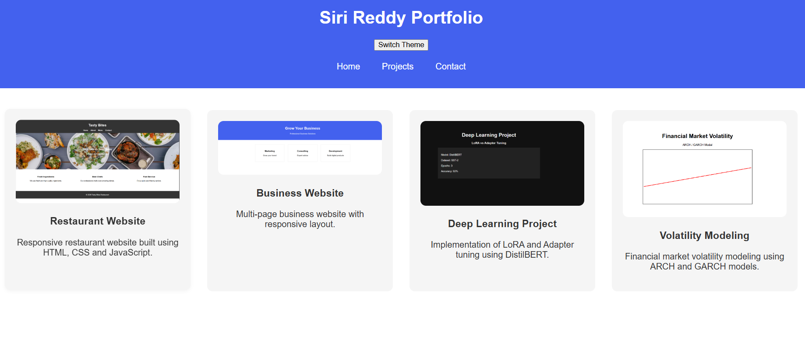
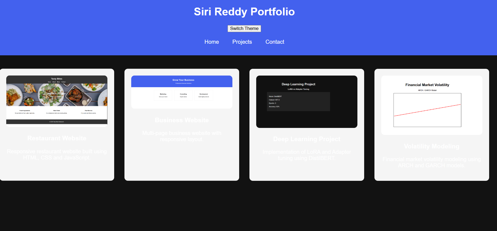

# Advanced Portfolio using CSS Grid

## Project Overview
This project is an advanced portfolio website built using HTML, CSS Grid, Flexbox, CSS Variables, and JavaScript.  
It showcases multiple projects with a responsive layout and theme switching functionality.

## Features
- CSS Grid layout for project cards
- Flexbox navigation bar
- CSS Variables for theme colors
- Smooth animations and hover effects
- Light and Dark theme switcher

## Technologies Used
- HTML5
- CSS3
- CSS Grid
- Flexbox
- JavaScript

## Project Structure

advanced-portfolio
│
├── index.html
├── README.md
│
├── css
│   ├── main.css
│   ├── layout.css
│   └── animations.css
│
├── js
│   └── theme-switcher.js
│
├── photos
│   ├── restaurant.png
│   ├── business.png
│   ├── deep learning.png
│   └── volatility.png
│
└── screenshots
    ├── light-theme.png
    └── dark-theme.png

## Screenshots

### Light Theme

### Dark Theme

## How to Run the Project
1. Download or clone the repository
2. Open the project folder
3. Run **index.html** in any browser

## Author
Siri Reddy  
B.Tech CSE (AI & ML)